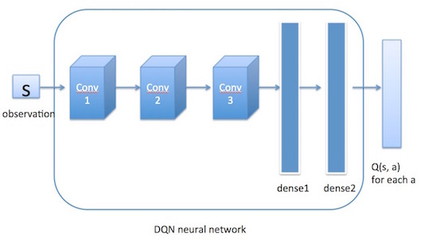

## 问题描述
&ensp;&ensp;&ensp;&ensp;挖掘机在建筑、施工等领域有着重要的地位，被广泛应用于采矿、勘探、环境恢复、考古调查、建筑和应急救援等不同应用。挖掘机被认为是用途最广泛的重型设备，拥有广阔的市场。 2018 年全球挖掘机市场规模为 441.2 亿美元，预计到 2026 年将增长到 631.4 亿美元。在中国，2018 年约有 160 万台挖掘机在运行，预计 2024 年将销售 38 万台新挖掘机。然而，挖掘被认为是最危险的作业之一，每年都会导致大量伤亡。在美国，每年大约有 200 人因塌方、地面坍塌或其他挖掘事件造成伤亡。随着更多挖掘机的使用，受伤和死亡的人数会越来越多。
&ensp;&ensp;&ensp;&ensp;目前，挖掘机由经过特定培训的操作员控制。这种长期培训不仅包括学习挖掘机动技术，还包括学习安全法规和标准。除了危及生命的事件外，操作员可能不得不在极端工作条件下操作挖掘机。例如，矿场通常位于偏远地区甚至沙漠中，那里的条件包括大量灰尘和极高或极低的温度。此外，地处偏远和远离城市导致现场挖掘机操作员的可用性有限。因此，工人的工作时间和负荷延长，这可能导致更高的疲劳和更多的伤害。在全球范围内，采矿和建筑劳动力面临着操作重型设备（包括挖掘机）的老龄化问题和劳动力短缺问题。

## 问题分析

&ensp;&ensp;&ensp;&ensp;一种解决方案是开发远程通过5G信号传输现场画面，由驾驶员远程对挖掘机进行操作控制，无法实现智能无人化控制液态挖掘机机械臂，增高了矿业挖掘人力成本，以及矿业生产效率增长速度受到了极大的限制。另一种解决方案是开发自动挖掘机，无需任何人工操作员即可在具有挑战性和危险的条件下运行。无人挖掘系统可以大大减少挖掘作业期间的伤亡人数。此外，这样的挖掘机可以长时间执行繁琐且重复的任务，从而提高整体吞吐量。

## 问题抽象

&ensp;&ensp;&ensp;&ensp;首先将问题抽象出挖掘区域，挖掘动作，挖掘点三个方面。
为更加清楚叙述问题，以挖掘机所在位置为原点，我们建立一个三维坐标系。z轴为垂直地面向下为正，y轴为挖掘机面向方向为正，x轴已与y轴垂直，挖掘机右手方向为正。

* 挖掘区域

&ensp;&ensp;&ensp;&ensp;
挖掘区域是一个长度，宽度，深度的立方区域，我们使用一个三维矩阵来表示挖掘区域。
第一维是z轴信息，即深度信息。
第二维是y轴信息，即挖掘机面向方向信息。
第三维是x轴信息，即挖掘机右手方向，与x轴垂直。
设矩阵一个单位表示20cm，如坐标[5,3,4]即表示深100cm，挖掘机面向方向60cm，右手边80cm一个20*20*20cm立方体。
在矩阵中，尚待被挖掘的点我们在矩阵中的元素使用数字*1*来表示，已经被挖掘的点我们使用数字*0*来表示。

* 挖掘动作

&ensp;&ensp;&ensp;&ensp;
挖掘动作设计使用**三次插值法**来确定挖掘轨迹，使挖掘轨迹更加平滑，确定轨迹内的矩阵元素，将轨迹所含元素值在矩阵内全部更改为*0*。
目前使用三种经典动作来进行挖掘。

* 挖掘点设计

&ensp;&ensp;&ensp;&ensp;
矩阵内所有元素都可作为入铲点。
但需符合物理逻辑，当某元素点上方有未挖掘点时，不可将此点作为入铲点。

## 解决方法

&ensp;&ensp;&ensp;&ensp;
基于优化挖掘路径规划及降低劳动成本方面考虑，我们使用深度强化学习算法**Deep Q Learning**来实现挖掘机无人自动化挖掘。
**Deep Q Learning**算法基于强化学习算法**Q-Learning**。
**Q-Learning**是强化学习算法中**value-based**的算法，**Q**即为**Q(s,a)**就是在某一时刻的 **s** 状态下$(s∈S)$，
采取动作**a** $(a∈A)$动作能够获得收益的期望，环境会根据**agent**的动作反馈相应的回报**reward r**，所以算法的主要思想就是将**State**与Action构建成一张**Q-table**来存储**Q**值，然后根据**Q**值来选取能够获得最大的收益的动作。

| **Q-Table** |  **a1**  |  **a2**  |
| :---------: | :------: | :------: |
|     s1      | q(s1,a1) | q(s1,a2) |
|     s2      | q(s2,a1) | q(s2,a2) |
|     s3      | q(s3,a1) | q(s3,a2) |

* 模型使用

&ensp;&ensp;&ensp;&ensp;
当我们使用**已训练好**的智能体时，**Q-table**已经固定，当智能体处在某环境s时，通过查询**Q-table**比较得到回报最高的动作。
$$
a = maxQ_\pi (s,a)
$$
其中$a∈A$,$\pi$是我们的策略,而我们最终目的是当我们完成目标时所得到的累积奖赏值达到最大化。
$$
         R_{sum} = \sum^{step}_0{R_{max}(S_t,A_t,S_t+1) }
$$

* 模型训练
  

&ensp;&ensp;&ensp;&ensp;
在**Q-learing**训练中，最重要的问题是**Q-table**里环境与动作所对应单元格值更改的公式，**Q-table**单元格里的值的大小决定我们在当前环境里使用的动作。这里我们使用的公式是
$$
Q^{*}(s, a)=\max _{\pi} \mathbb{E}\left[r_{t}+\gamma r_{t+1}+\gamma^{2} r_{t+2}+\ldots \mid s_{t}=s, a_{t}=a, \pi\right]
$$
这个公式指的就是智能体在当前状态s下，选择动作*a*时所对应的*Q(s,a)*等于当前时刻所取得的奖励 $r_t$加上之后所能取得的最大奖励。
其中$\gamma$是我们设置的衰减值，$r_{t+1}$代表下一步的回报。

* 学习流程

1. 创建并初始化一个action-space*state space大小的Q表，一般初始化设置所有值为0；

2. 进入循环，直到达到迭代条件：

3. 检索Q表，在当前状态 s下根据Q的估计值和Policy选择一个action a；

4. 执行action a，检索Q表，转移到的状态对应的Q最大值加上该动作得到的实时奖励reward是状态 s价值的真实值；

5. 根据策略方程更新Q表。

由于状态空间与动作空间过大，使用一张表来实现，表的占用内存过大及效率问题，我门选择使用神经网络近似模拟值函数**Q(s,a)**。
$$
Q^{(s,a,w)}≈Q_π(s,a)
$$
其中w代表卷积神经网络。

&ensp;&ensp;&ensp;&ensp;
通过神经网络计算出值函数后，DQN使用$ϵ−greedy$策略来输出action。值函数网络与$ϵ−greedy$策略之间的联系是这样的：首先环境会给出一个obs，智能体根据值函数网络得到关于这个obs的所有Q(s,a)，然后利用ϵ−greedy选择action并做出决策，环境接收到此action后会给出一个奖励及下一个obs。这是一个step。此时我们根据Rew去更新值函数网络的参数。接着进入下一个step。如此循环下去，直到我们训练出了一个好的值函数网络。

* DQN算法整体流程
1. 首先初始化Memory D，它的容量为N;
2. 初始化Q网络，随机生成权重ωω;
3. 初始化target Q网络，权重为ω−=ωω−=ω;
4. 循环遍历episode =1, 2, …, M:
5. 初始化initial state S1S1;
6. 循环遍历step =1,2,…, T:
   * 用ϵ−greedyϵ−greedy策略生成action atat：以ϵϵ概率选择一个随机的action，或选择at=maxaQ(St,a;1. ω)at=maxaQ(St,a;ω);
   * 执行action atat，接收reward rtrt及新的state St+1St+1;
   * 将transition样本 (St,at,rt,St+1)(St,at,rt,St+1)存入D中；
   * 从D中随机抽取一个minibatch的transitions (Sj,aj,rj,Sj+1)(Sj,aj,rj,Sj+1)；
   * 令yj=rjyj=rj，如果 j+1j+1步是terminal的话，否则，令 yj=rj+γmaxa′Q(St+1,a′;ω−)yj=rj+γmaxa′Q(St+1,a′;ω−)；
   * 对(yj−Q(St,aj;ω))2(yj−Q(St,aj;ω))2关于ωω使用梯度下降法进行更新；
   * 每隔C steps更新target Q网络，ω−=ωω−=ω。
7. End For;
8. End For;
算法流程图

*实验设置

&ensp;&ensp;&ensp;&ensp;
在本次实验中，我们首先采取2d环境进行模拟实验，去掉宽度这一限制，默认宽度为1。
我们智能体参数设置

| **参数名** | **值** |                           **说明**                           |
| :--------: | :----: | :----------------------------------------------------------: |
|     lr     | 0.0001 |                 Learning rate for optimizer                  |
|    eps     |  1.0   | Starting value for epsilon in epsilon-greedy action selection |
|  eps_dec   |  1e-6  |             Linear factor for decreasing epsilon             |
|  eps_min   |  0.1   | Minimum value for epsilon in epsilon-greedy action selection |
|  max_mem   | 50000  |            Maximum size for memory replay buffer             |
|     bs     |   32   |            Batch size for replay memory sampling             |
|  replace   |  1000  |            Batch size for replay memory sampling             |
|    seed    |   1    |                         random seed                          |

使用DQN算法对挖掘环境进行强化学习，得出收敛结果。

&ensp;&ensp;&ensp;&ensp;
对于将挖掘区域全部挖掘的好坏进行评价，我们采用了两个评价标准。
一个是挖掘的速度，与人工挖掘进行对比。
一个是挖掘的效率，即每铲下去的满斗率（满斗率指一个挖掘动作内铲斗挖掘土块体积所占铲斗体积比例）。

`
   pandoc excavator.md -o re.docx
`

