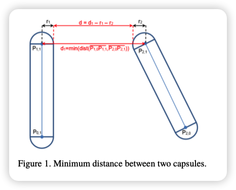

# Deep Reinforcement Learning with Double Q-learning   
arXiv:1509.06461v3 8 Dec2015

## 提出问题：
>众所周知，流行的 Q 学习算法会在某些条件下高估动作值。 以前不知道在实践中这种高估是否普遍，它们是否会损害绩效，以及它们是否通常可以避免。 在本文中，肯定地回答了所有这些问题。  
## 使用方法：
>我们提出了对 DQN 算法的特定适应，并表明生成的算法不仅减少了观察到的高估，正如假设的那样，而且这也导致了在几个游戏中更好的性能。

为了解决顺序决策问题，我们可以学习对每个动作的最优值的估计，定义为采取该动作并随后遵循最优策略时未来奖励的预期总和。 在给定策略 π 下，状态 s 中动作 a 的真实值是
$$ Q_π (s, a) ≡ E [R_1 + γ R_2 + . . . | S_ 0 = s, A_0 = a, π] $$

其中 γ ∈ [0, 1] 是折衷因子，它权衡了即时奖励和后续奖励的重要性。 最优值是 $Q_∗ (s, a) = max_π Q_π (s, a)$。 通过在每个状态中选择最高值的动作，可以很容易地从最优值推导出最优策略。

可以使用 Q 学习 (Watkins, 1989) 来学习对最佳动作值的估计，这是一种时间差异学习 (Sutton, 1988)。 大多数有趣的问题太大而无法分别学习所有状态下的所有动作值。 相反，我们可以学习一个参数化的值函数 $Q(s, a; θ_t)$。 在状态 $S_t$ 中采取行动 $A_t$ 并观察即时奖励 $R_{t+1}$ 和结果状态 $S_{t+1}$ 之后，参数的标准 Q 学习更新为

$$θ_{t+1} = θ_t +α(Y_t^Q -Q(S_t , A_t ; θ_ t ))∇_{θ_t} Q(S_t , A_t ; θ_t ) $$

其中 α 是标量步长，目标 $Y_t^Q$ 定义为

$$Y_t^Q ≡ R_{t+1} + γ max_a Q(S_{t+1} , a; θ_t )$$

此更新类似于随机梯度下降，将当前值 $Q(S_t , A_t ; θ_t )$更新为目标值 $Y_t^Q$ 。

Double Q-learning学习误差可以写为

$$Y_t^{DoubleQ} ≡ R_{t+1}+ γ Q(S_{t+1}, argmax_a Q(S_{t+1}, a; θ_t); θ_t^′ )$$

Double Q-learning学习的思想是通过将目标中的最大操作分解为动作选择和动作评估来减少高估。 虽然没有完全解耦，但 DQN 架构中的目标网络提供了第二个价值函数的自然候选者，而无需引入额外的网络。 因此，我们建议根据在线网络评估贪心策略，但使用目标网络来估计其值。 关于双 Q 学习和 DQN，我们将生成的算法称为双 DQN。 它的更新与 DQN 相同，但将目标$Y_t^{DQN}$替换为
$$Y_t^{DoubleQ} ≡ R_{t+1}+ γ Q(S_{t+1}, argmax_a Q(S_{t+1}, a; θ_t); θ_t^′ )$$

顶部和中间的行显示了 DQN（橙色）和 Double DQN（蓝色）对六款 Atari 游戏的价值估计。结果是通过使用 Mnih 等人使用的超参数运行具有 6 个不同随机种子的 DQN 和 Double DQN 获得的。 （2015 年）。较暗的线表示种子的中位数，我们对两个极值进行平均以获得阴影区域（即线性插值的 10% 和 90% 分位数）。顶行中的水平橙色（DQN）和蓝色（Double DQN）直线是通过在学习结束后运行相应的代理来计算的，并平均从每个访问状态获得的实际折扣回报。如果没有偏差，这些直线将匹配图右侧的学习曲线。中间一行显示了两场比赛的价值估计（以对数表示），其中 DQN 的过度乐观非常极端。底行显示了这对代理在训练期间评估时所获得的分数的不利影响：当高估开始时分数下降。使用 Double DQN 学习更加稳定。
## 总结：
>特别是，我们首先表明，最近的 DQN 算法将 Q 学习与深度神经网络相结合，在 Atari 2600 领域的某些游戏中存在严重高估的问题。 然后，我们展示了在表格设置中引入的双 Q 学习算法背后的思想，可以推广到大规模函数逼近。

# An autonomous excavator system for material loading tasks

## 提出问题：

>由于岩石滑动、地面塌陷或过多灰尘等极端条件，在现实环境中操作挖掘机可能具有挑战性，并可能导致人员伤亡。在这里，我们展示了一种用于物料装载任务的自主挖掘机系统 (AES)。

## 使用方法：

>我们的系统可以处理不同的环境，并使用结合了感知和规划的架构。我们融合了多模态感知传感器，包括 LiDAR 和摄像头，以及高级图像增强、材料和纹理分类以及对象检测算法。我们还提出了分层任务和运动规划算法，将基于学习的技术与基于优化的方法相结合，并与感知模块和控制器模块紧密集成。

**效率**、**稳健性**和**通用性**是设计自主挖掘机的三个基本要求。

换句话说，自主挖掘机应该在没有人工干预的情况下运行，同时执行与**人工等效的工作量**。 此外，由此产生的挖掘机系统应该能够感知周围环境以监测目标材料状态并在极端条件下检测杂质和障碍物。 系统应该产生可行的运动，同时**避免与障碍物发生任何碰撞**。 所需的系统还应处理多种类型的环境和材料，并在不同的天气条件下运行。

## 解决的问题

我们解决了以下挑战：
1. 系统需要在因地形类型、天气和光照条件而异的广泛环境条件下运行。负责了解周围环境的感知模块需要在不同的场景中发挥作用。

2. 挖掘机经常用于将一堆材料装载到自卸卡车上。我们将材料称为目标材料。此外，在每次舀取和倾倒物料后，目标物料堆的形状都会发生变化。因此，我们需要实时技术对桩的形状和材料类型进行在线建模。

3. 无论材料的类型或特性如何，材料的舀取都必须成功，这取决于密度、硬度或质地。

4. **挖出物料后，挖掘机必须成功地将物料倾倒到卡车中，同时避免与卡车、料堆或环境中的其他障碍物发生碰撞。**

5. 自卸车车身区域的位置在挖掘过程中可能会有很大的变化。我们需要开发强大的在线检测方法来确定卡车的姿态。

   鉴于这些具有挑战性的挖掘场景，我们为我们的自动挖掘机系统 (AES) 提出了一套算法和一个强大的系统架构。我们的系统由三个主要模块组成——**感知、规划和控制**，以及硬件传感器层和图形用户界面 (GUI) 应用程序层。规划和控制模块由感知结果驱动。具体来说，我们在挖掘机上安装了 LiDAR（光检测和测距）、摄像头和实时运动 (RTK) 定位设备，并使用多模态传感器融合方法感知周围环境和目标对象的属性。
   

## 控制

   在感知结果的基础上，我们为挖掘机臂和底座运动设计了一个由**任务级规划层和运动规划层**组成的**分层规划模块**。我们的规划方法将逆强化学习 (IRL) 和数据驱动的模仿学习 (IL) 的优势与基于优化的方法的效率相结合。任务级规划中的挖掘目标选择试图从人类操作员演示中学习与挖掘策略相对应的运动，例如下一个挖取位置。运动生成层揭示了人工挖掘运动的运动模式。我们将这种运动模式与基于随机优化的算法相结合，以生成用于挖取和倾倒运动的轨迹。与卡车或建筑物相对应的额外避障约束也被添加到我们的优化公式中。为了规划挖掘机底座和臂的运动，我们根据挖掘机臂的可达性图将整体任务分解为一系列挖掘子任务。我们的规划算法假设挖掘机底座对于每个挖掘子任务都保持静止。在不同的子任务之间，我们使用基于搜索的运动规划器为挖掘机的底座生成可行的路径。

## 不同开挖场景的系统验证

| 场景一 |          装卸物料          |
| :----: | :------------------------: |
| 场景二 |          岩石清除          |
| 场景三 |            避障            |
| 场景四 |          雨中装载          |
| 场景五 | 岩石清除与避障相结合的场景 |
| 场景六 | 岩石去除与水处理的组合场景 |
| 场景七 |  避障与水处理相结合的场景  |
| 场景八 |       全栈式开挖场景       |
| 场景九 |          挖沟场景          |
| 场景十 |       大土堆拆除场景       |

## 总结：

>我们新设计的 AES 已经过广泛的鲁棒性和效率测试。我们的 AES 已投入部署以进行长期运营。它将人类操作员从废物处理应用中的危险条件中移除，并实现 24 小时每次干预 (HPI)。
>
>与现有的无人挖掘机系统相比，我们的整体架构很大程度上依赖于感知模块来对周围环境和目标物体进行细粒度的 2D/3D 理解。因此，我们方法的整体性能主要取决于感知算法和传感器硬件的准确性。在重型机械应用中，我们传感器硬件的可靠性对于确保 AES 的稳健性起着重要作用。最近在更好的激光雷达和相机传感器以及先进的计算机视觉算法方面的发展可以进一步提高我们的感知性能。我们没有考虑可能存在雪或冰的情况。这样的场景不仅对感知模块而且对规划和控制模块都带来了许多挑战。作为未来工作的一部分，我们建议评估和扩展 AES 的能力，以处理更具挑战性的天气和照明条件。

# AES: Autonomous Excavator System for Real-World and Hazardous Environments

## 使用方法：

>我们提出了一种自主挖掘机系统 (AES)，用于材料装载和土壤挖掘任务。我们的系统能够处理不同的环境和不确定性，并使用结合了感知和规划的新颖架构。

## 讨论和总结

>我们新设计的自主挖掘机系统经过了广泛的鲁棒性和效率测试，其有效性已在上面得到证明。我们的系统是第一个用于长时间运行的自动挖掘机系统。在废物处理应用中，我们的自动挖掘机系统将人工操作员从危险状态中替代出来，并实现了 24 HPI（每次干预的小时数）。同时，我们的系统目前用于采矿应用，由于可能发生落石，这很危险。
>
>与之前开发的现有无人挖掘机系统相比，我们的整体架构很大程度上依赖于感知模块对周围环境的细粒度理解。因此，我们的性能主要取决于感知算法和传感器硬件的准确性。在重型机械应用中，传感器硬件的可靠性起着重要作用。最近在更好的激光雷达和相机传感器方面的发展，以及改进的计算机视觉算法，可以进一步提高我们感知模块的性能。此外，我们目前还没有考虑出现雪或冰的场景。这样的场景不仅给感知模块带来了许多挑战，也给规划和控制模块带来了许多挑战。我们的目标是进一步评估在更具挑战性的天气和照明条件下的性能。

# Hierarchical Planning for Autonomous Excavator on Material Loading Tasks

## 提出问题

> 由于操作挖掘机的劳动力短缺和危险的工作环境，自动挖掘机近年来发展迅速。 我们提出了一种用于自主挖掘机的新型分层规划系统。 总体规划系统由用于任务划分和基础运动规划的高级任务规划器和具有运动原语的通用子任务规划器组成，包括手臂和基础运动。

## 解决问题

>  挖掘任务规划器的关键组件是用于**工作区域划分**和**挖掘路径**生成的模块。 在 [6] 中，Kim 等人。 介绍智能导航策略，这对于自动化土方系统有效执行挖掘至关重要。 在 [7] 中，Kim 等人。 结合土方工程的特点，提出了一种完整的覆盖路径规划（CCPP）算法。 此外，还提出了一种路径相似性分析方法来测试 CCPP 算法的有效性。
>
> 我们首先处理了种类繁多的**挖掘任务类型**的问题，并为挖掘任务划分和基础移动计划设计了一个高级任务计划器。然后我们抽象出两类具有良好可移植性和通用性的子任务规划器，包括材料去除子任务规划器和基移动子任务规划器。接下来，我们封装运动图元并为它们提供合适的控制器，用于关节控制和基础控制。最后，我们实施了我们的方法，并在真实世界的实验和具有一系列挖掘机的动态模拟环境中进一步验证了它。结果表明，系统架构和规划器算法能够生成有效的工作计划，这些计划可以以一般方式输入到自主挖掘系统中。

[^6]: Sung-Keun Kim, Jongwon Seo, and Jeffrey S Russell. Intelligent navigation strategies for an automated earthwork system. Automation in Construction, 21:132–147, 2012.
[^7]: Jeonghwan Kim, Dong-eun Lee, and Jongwon Seo. Task planning strategy and path similarity analysis for an autonomous excavator. Automation in Construction, 112:103108, 2020.

1. 绪论
2. 基于强化学习的自主挖掘系统
3. 感知
4. 基于DDPG的动臂斗杆铲斗的动作轨迹规划
5. 基于DQN的挖掘轨迹规划
6. 自主挖掘系统的实现与验证
7. 总结与展望

# Optimization-Based Framework for Excavation Trajectory Generation

## 提出问题

> 我们提出了一种新的基于优化的框架，用于在特定任务约束下生成自主挖掘机轨迹。 传统的开挖轨迹生成器过度简化了几何轨迹参数化，从而限制了优化空间。 为了扩大搜索空间，我们通过约束铲斗的瞬时运动并添加面向目标的约束来控制挖掘的土壤量，从而制定了挖掘的通用任务规范。

## 解决问题

本文提出了一种新的基于优化的挖掘轨迹生成框架。具体来说，联合配置空间中的连续轨迹由多项式样条插值的离散路点表示。除了航路点，时间间隔作为变量引入，这有助于明确安排轨迹的时间分布。施加一组面向过程的几何约束，以确保铲斗运动服从挖掘原理。为了收集足够数量的土壤，我们添加了一个面向目标的约束，即表示挖掘土壤的估计数量的扫掠体积因子。这种基于约束的任务规范保证了挖掘的成功，并为轨迹优化提供了很大的空间。该框架适用于各种目标函数，例如最小时间、最小关节位移和最小扭矩等。

1）铲斗运动不断导致铲斗前土体破坏，即前土体未能保持其原始几何形状和位移[6]；

2) 破坏土堆积在铲斗底板上或前面（铲斗形状如图1（b）所示）；
3) 3）当破坏的土壤积累足够时，它会被卷入桶中并被提升到地形之外。

我们使用在离散路点之间插值的二阶可微多项式样条 s(t) 来表示挖掘轨迹。 虽然三次样条足以满足平滑度的要求，但我们采用了混合阶样条：末端的两个段用五次多项式插值，而其余路点用三次样条插值，如图 所示。

1）在轨迹的两端，斗尖位置被约束接触地形；

2）在第一个点，应与地形表面的法向量t相反进入地形；

3）在最后一点，应沿地形t的法向量离开；

4) 沿着整个路径，单调旋转；

5) 沿着整条路径，t指向h的左半边；

6）在第一个点，h应该与地形表面的法向量相反，才能进入地形；

7）最后一点，h应向上，以免收集到的土壤溢出；

8）沿整个路径，h必须保持不变或顺时针旋转，否则桶背会压土；

（底板的方向称为 h，将铲斗尖端的平移方向称为文本的其余部分 t）

# Planning and Control for Autonomous Excavation
## 提出问题
> 自主挖掘的主要影响是挖掘循环期间的工具土相互作用力，它可以超过移动挖掘机臂所需的力。 土壤的成分、粒度、湿度、密度和许多其他特性以及可能的障碍物，例如根或石头，都会影响施加的力。 目前，没有传感器或测量方法可以在与土壤相互作用之前识别这些特性。 此外，这些特性可以在同一挖掘区域内发生巨大变化，不仅在垂直方向上，而且在水平方向上，都使得捕捉和抵消它们成为一项极具挑战性的任务。

## 解决问题

> 这篇论文提出了一种新的自主挖掘规划和控制方法，该方法独立于土壤成分并且超越了单次挖掘。与主要基于铲斗运动的位置轨迹的现有工作相比，我们直接通过末端执行器力-扭矩轨迹定义单个挖掘周期。该轨迹适用于不同类型的土壤，从而导致专业操作员使用铲斗运动来适应不同的地形。因此，我们可以克服当前方法的局限性，即土壤相互作用力占主导地位并且极难预测或估计。使用分层优化方法控制冗余挖掘机臂的末端执行器力和运动。此外，提出了一种大规模迭代规划器来连续执行单次挖掘，直到获得所需的地面几何形状。所示的模拟结果包括精确重建所需地面形状的多点挖掘。

单次挖掘循环的目标是尽可能快且可靠地装满铲斗。 如果每次挖掘都 会产生一个独立于土壤的完整桶，那么该过程是可靠的。 这是机器效率最大化所必需的。 尽管其他人大多使用位置轨迹来填充铲斗，但这项工作为此使用了力/扭矩轨迹，如图 3 所示，并在图 4 中可视化。力/扭矩轨迹是用知识手工设计的 机器可以产生的最大力/扭矩。

## 结论

> 这篇论文中提出的工作旨在通过（i）挖掘机臂的分层优化控制器，（ii）独立于土壤的力控制的单次挖掘循环和（iii）迭代规划器来改变这一点，以实现所需的地面轮廓。任务空间臂控制器捕获系统的整个动态，并能够处理驱动中的位置、速度和力限制。此外，分层优化用于利用手臂的冗余来优化方向力的可操作性。应用于不同土壤成分的单个挖掘循环的力轨迹显示出一种自然出现的行为，受到专业操作员的青睐。此外，力轨迹的执行使其能够可靠地将铲子填满至其最大容量，从而实现单次挖掘的最大效率。规划者连接这些单一的挖掘以实现所需的地面轮廓，而不会忽略沟槽的稳定性。所有这一切都是在没有对土壤进行任何假设的情况下实现的。

# Planning and Control for Autonomous Excavation
## 提出问题

> 自主挖掘的主要影响是挖掘循环期间的工具土相互作用力，它可以超过移动挖掘机臂所需的力。 土壤的成分、粒度、湿度、密度和许多其他特性以及可能的障碍物，例如根或石头，都会影响施加的力。 目前，没有传感器或测量方法可以在与土壤相互作用之前识别这些特性。 此外，这些特性可以在同一挖掘区域内发生巨大变化，不仅在垂直方向上，而且在水平方向上，都使得捕捉和抵消它们成为一项极具挑战性的任务。

## 解决问题

> 这篇论文提出了一种解决自主挖掘问题的新策略，将单个挖掘周期定义为末端执行器的相互作用力轨迹而不是位置轨迹。位置轨迹可能导致任意高的力，而力轨迹可以根据力限制的知识进行设计。将此力轨迹应用于不同类型的土壤，会根据土壤产生不同的运动。在软土中，自然出现的运动可以描述为“穿透和旋转”，而对于硬土，它更好地描述为“穿透和拖动”[1]。 Bradley 和 Seward 从操作员研究中得出结论，专家操作员正是使用这两种基本策略来适应不同类型的土壤。此外，由于积极的力轨迹将使机器保持在高负载下，因此机器效率很高。

## 分层优化控制器

分层优化臂控制器基于 Bellicoso 等人实施的分层优化。 [19]，它解决了作为约束二次优化的控制问题。 优化的解向量 x d 由期望的运动 u 和期望的力 τ d 组成

在这项工作中使用的一组优先任务的优先级递减

1) 运动方程

2) 气缸力/扭矩限制

3) 气缸速度限制

4) 气缸位置限制

5) 末端执行器运动

6) 方向力可操作性

挖掘周期的不同阶段按时间顺序从左到右
施加力-扭矩轨迹时可能产生的运动的图示。 蓝色箭头是力，橙色箭头是图 3 中所示的扭矩，具有三相“穿透”、“拖动”和“关闭”。

## 单次挖掘的力度控制

> 尽管其他人大多使用位置轨迹来填充铲斗，但这项工作为此使用了力/扭矩轨迹。力/力矩轨迹由手动依据机器可以产生的最大力/扭矩信息而设计。
>
> 在挖掘具有所需地形形状的沟槽的简单示例中。单次挖掘不应违反该形状，以便生成的几何形状符合要求。为此，施加到铲斗的力轨迹的形状使得在接近所需几何形状时不会违反几何形状。由于挖掘机的主要工作方向在悬臂平面内，因此驾驶室旋转在所有三个阶段都保持恒定，直到铲子着地时最初获得的 ψ PoA 值，由以下 PID( ψ PoA ) 表示小节。此外，在穿透和拖动阶段，铲油缸被锁定，因此铲的方向没有明确控制。施加到铲原点的强力以及由此产生的不可预测的运动阻止了对铲方向的控制。
> 请注意，所提出的手臂控制器方法允许控制末端执行器的力和垂直方向的运动。

### 穿透

铲斗的角度调整到实际的地形坡度。土壤被一个负 z 方向的力 F z,pen 穿透。通过观察桶在同一方向上的速度来切换到下一个状态。如果速度低于某个阈值，控制器将切换到下一阶段，因为这意味着穿透运动已经停止，如 [1] 中所示。此外，铲斗在 x 方向的位置通过 PID 控制器进行控制。这避免了铲斗在穿过倾斜表面时沿 x 方向滑离攻击点。当接近所需几何形状时，通过以因子 s pen 按比例缩小穿透力 F z,pen 来控制穿透阶段的深度，即铲刃到所需几何形状的距离 d 小于阈值 θ .

### 拖曳

铲斗以负的 x 和 z 力、Fx,drag 和 F z,drag resp. 被拖向挖掘机。x 力说明了实际的拖动，其中 z 力保证铲斗移动通过 土壤尽可能深。 在使用位置轨迹的情况下，定义拖动必须停止的点是直截了当的。

### 返回

最后阶段通过向铲斗施加扭矩 τclose 来关闭铲斗。 当桶在世界框架中的某个角度时，关闭阶段结束。 此外，还有一个很小的力 F z,close 将铲斗向下推以避免溢出。 除此之外，铲斗的位置没有任何限制，这意味着它将对阻碍关闭运动的任何障碍物做出顺应反应。 关闭阶段在接近所需几何形状时保持不变，因为主要运动是由于 τclose 而导致的铲斗方向的变化并且没有平移运动。

## 多个挖掘周期的挖掘计划

扫描地形的高程存储在使用 Fankhauser [17] 开发的 Grid Map 库实现的 2.5 维高程图中。网格分辨率为 0.2 m。

有限状态机将挖掘任务安排在多个挖掘周期中。 如图 6 所示，首先用来自 CAD 模型的所需高程图初始化开挖规划器。 它使用地图的网格大小从上方进行光线追踪。 然后规划器找到下一个合适的攻击点 (PoA)，如第 IV-B 节所述。 使用第三节中描述的力轨迹进行挖掘，直到整个高程图的误差小于 θ + 。 之后，执行细化步骤，其中铲子尽可能靠近所需高度的位置和倾斜度。 在这个细化步骤中，位置轨迹是可行的，因为保证高程图的误差小于某个阈值。 这一小层土壤只会对位置控制器造成轻微干扰。

## 结果

本节中显示的结果是使用表 I 中描述的参数集产生的。挖掘机动力学和土壤力学是使用 Vortex 模拟的。

目前还没有自主挖掘机能够稳健地处理需要更高精确度和精细度的任务，例如挖掘建筑物的地下室。这篇文章中提出的工作旨在通过（i）挖掘机臂的分层优化控制器，（ii）独立于土壤的力控制的单次挖掘循环和（iii）迭代规划器来改变这一点，以实现所需的地面轮廓。任务空间臂控制器捕获系统的整个动态，并能够处理驱动中的位置、速度和力限制。此外，分层优化用于利用手臂的冗余来优化方向力的可操作性。

# TaskNet: A Neural Task Planner for Autonomous  Excavator

## 提出问题

> 由于近年来对自动驾驶技术的广泛研究，在感知、定位和导航等领域取得了显著成果[5]，此外，光探测与测距（LiDAR）和摄像头等硬件传感器也得到了大力发展，扩大了构建完全自主操作的挖掘机的可能性。构建自主挖掘机的规划和控制系统的一个主要挑战是制定可行且高效的挖掘任务计划和挖掘机执行的运动轨迹。建筑机械的机器人运动规划问题已被广泛研究[6]，[7]。然而自动生成一系列运动规划子任务来完成一项任务仍未解决。这样的挖掘计划需要高效，基础移动少，与挖掘机硬件约束兼容，以产生高执行成功率。一般来说，用于计算可行离散决策和连续无碰撞运动的组合搜索空间是高维的。由于高维搜索空间以及不同的任务和运动规划要求 [8]、[9]、[10]，集成任务和运动规划器具有挑战性。

## 解决问题

> ​	我们提出了一种新的任务规划器——基于数据驱动方法的自动挖掘机任务网络，它通过从演示数据中学习来规划可行的任务级序列。给定一个高级挖掘目标，我们的 TaskNetplanner 可以将其分解为子任务，每个子任务都可以进一步分解为具有规范的任务原语。我们使用挖掘跟踪生成器训练我们的 TaskNet，并使用基于物理的 3D 地形和挖掘机评估其性能模拟器。与基于模仿学习的方法相比，实验结果表明TaskNet可以有效地学习任务分解策略。得到的任务原语序列可以用作任何挖掘机运动规划器的输入，以生成可行的关节级轨迹。我们在最先进的自动挖掘机硬件和软件系统上进一步验证了 TaskNet。 49吨自主挖掘机可顺利完成装料任务。

基于学习的任务计划方法引起了越来越多的关注，并在机器人领域得到了积极的研究。 基于模仿学习的方法 [11]、[12]、[13] 专注于开发神经网络模型，以从人类演示中学习潜在的序列决策策略。 其他人[14]利用基于强化学习的方法进一步探索解决方案空间以提高效率。 这些基于学习的方法能够推广到环境变化的多个任务并继承隐藏的人类行为模式。 这些特性使基于学习的方法成为自主挖掘任务规划的可行和实用的选择。 然而，此类应用尚未针对挖掘任务进行彻底调查。

在本文中，我们利用基于学习的方法来解决挖掘机任务规划问题。在挖掘任务中，操作顺序通常可以分为基础运动和手臂操作类别，而手臂操作可以进一步分解为选择下一个挖掘位置和挖掘深度。我们利用挖掘任务的分层特性，提出了一个具有多层模型的 TaskNet 架构，将高级目标转换为子任务，然后是任务原语。

本文的主要贡献是新的基于神经网络的挖掘任务规划公式，它利用了挖掘任务表示的结构。关键思想是将观察顺序转换为潜在空间表示，并将详细说明传达给子级别模型。最终生成具有规范的详细任务原语来规划挖掘运动轨迹。确定的任务原语也可以用于在线策略执行。实验结果表明，TaskNet 可以有效地从演示中学习任务分解策略。仿真结果表明，与基于基准学习的模型相比，我们的 TaskNet 提高了有效性。此外，真实世界的实验表明，基于 TaskNet 的自主挖掘机系统在材料装载任务中实现了接近人类的效率。

本文旨在弥合基于规则的挖掘任务规划和基于学习的神经编程方法之间的差距。 设计这种规划器的挑战如下。 首先，现实世界的挖掘任务规划需要快速的任务分解算法和环境观察反馈。 同时，它需要接近完美的操作安全成功率。 此外，需要可泛化或可重新训练的基于学习的模型来处理各种挖掘任务。

### A. 问题定义

本文考虑自主挖掘机的任务规划问题。我们特别关注挖掘任务，例如挖沟、挖掘和材料搬迁，这些任务涉及改变地形形状。令 T 为任务描述集，O 表示环境观察集。让函数 g : T × O → { 0, 1 } 证明任务是否完成（g = 1）或未完成（g = 0）。要设计的任务计划器可以将这样的主要任务分解为子任务序列，然后分别将任务原语与规范分开。令 S 为子任务集，A 表示子任务规范集。令 P 为任务原语集，B 表示任务原子规范集。规范字段提供了低级运动规划器和控制器的详细信息，以便它们能够以高成功率执行。此外，我们利用数据驱动的方法来解决此类任务规划问题，以模仿人类操作员的行为。正式的问题陈述如下。
问题 1：给定时间 t 的环境观察反馈 o(t) ∈ O 和任务描述 t_a ∈ T，设计一个任务规划器，使其可以生成一系列子任务和规范
[(s_1 , a_1 ), (s_2 , a_2 ), (s_3 , a_3 ), ..., (s_m , a_m )],
其中 s_i ∈ S 和 a_i ∈ A; 此外，计划者应将此类序列转换为具有详细规范的任务原语
Φ = [(p_1 , b_1 ), (p_2 , b_2 ), (p_3 , b_3 ), ..., (p_n , b_n )],
其中 p_i ∈ P 和 b_i ∈ B。在执行任务原语 g(t_a , o(t)) = 1 之后。

### B. 环境和客观表示的网格图

我们将地形观测表示为二维网格图，其中 G (p, q) 表示地形网格图第 p 行第 q 列单元格的高度值。 图 1 显示了一个网格高度图的示例，它是从现实世界中捕获的 3D LiDAR 点转换而来的。 单元的尺寸选择为与挖掘机铲斗宽度相同。 与原始 3D 点、3D 网格或其他表示相比，网格图表示可以方便地通过神经网络模型作为输入格式进行分析。
典型的挖掘任务会改变地形的形状，这可以通过为网格图中的每个单元格指定目标高度 Gtarget 来定义，并进一步定义为实际高度与目标高度之间的差 G。 任务目标可以指定为：
	G(p, q) = | G (p, q) − G target(p, q) | <$\varepsilon$ , ∀ p and q

### C. 算法概述

我们采用神经编程的思想，本文提出的算法将一般任务作为输入，递归地触发子任务或任务原子。通常，在挖掘任务中，操作顺序通常可以分为两类。一类是将挖掘机底座移动到一个位置；另一种是在基地保持静止的情况下进行挖掘。因此我们设计了移动到待挖掘块和挖掘待挖掘块两个子任务来描述这两类运动。此外，在使用固定底座进行挖掘时，挖掘机臂的运动可以分解为选择下一个挖掘点，挖掘具有选定深度的特定位置，然后倾倒到所需位置。因此，我们引入了接近挖掘和倾倒的运动原子来表达这些手臂运动。此外，还添加了一个运动原子移动基础，以进一步将子任务移动到瓦片分解为可执行级别。表 I 显示了引入的子任务和运动原子。

|             (S×A)              |         (P × B)         |
| :----------------------------: | :---------------------: |
|   (移动到待挖掘块, 全局坐标)   | (move base, trajectory) |
| （挖掘待挖掘块，待挖掘块地形） |   （接近，局部坐标）    |
|                                |     （挖掘，深度）      |
|                                |   （倾倒，本地坐标）    |

D. 从离散计划到连续运动 

所提出的分层任务计划器分解高级任务并产生一系列具有规范的任务原语。 生成的基元序列对于现有的规划算法来说是一个自然直接的运动规划问题。 这些具有详细规范的任务原语被馈送到运动规划器以生成轨迹。 关节运动或挖掘机底座运动的轨迹将由挖掘机控制器执行。 除了生成整个基元序列，TaskNet 还可以用于在线策略执行，TaskNet 根据当前观察确定任务基元，然后将其发送给运动规划器和控制器进行在线执行。

## 模型

模型架构。 TEM 和 CEM 共享相同的网络结构，但使用不同的权重。 规划核心网络由 2 层卷积神经网络 (CNN) 组成，内核大小为 3，步幅大小为 1，填充大小为 1。每个 CNN 层后面都有一个 ReLU 激活函数和内核大小为 2 的 MaxPooling， 步幅大小为 1。解码器都是多层感知器，具有 2 层大小为 128 的全连接 (FC) 神经网络。

待挖掘块开挖模型
在这个待挖掘块挖掘规划级别，给定块状地图作为输入任务，我们需要确定块状的全局序列以覆盖大地形。 TEM根据最新的挖掘块地图和挖掘块的历史预测挖掘机需要操作的下一块挖掘块。 特别是，TEM 采用瓦片图 G 瓦片 (t) 的输入和子任务 (s(t), s(t-1), ..., s(t-k)) 的过去结果。

我们实现了我们的神经任务规划器 TaskNet，并使用基于 3D 物理的模拟器对各种挖掘场景进行了测试。 然后我们在现实世界中的自动挖掘机系统上验证 TaskNet。

规划器实施和模拟结果

我们使用经过训练的待挖掘块挖掘模型和单元挖掘模型来实现任务规划器 TaskNet。 任务规划器将高级任务目标作为输入，例如挖一个具有所需深度的矩形作为目标高度图 G target 。 它分解任务并生成具有运动规划器规范的运动原语序列。 运动规划器模型根据规范计算可行的手臂和基础运动。 我们利用轨迹优化进行手臂运动规划和基于网格的基本运动搜索算法。

在本实验中，TEM 和 CEM 模型的训练数据序列大多是通过基于规则的模拟自动合成的。模拟规则被设置为尽可能模仿在现实世界中观察到的人类行为。真实世界的数据应该不同于我们合成的数据序列，并且是更好的训练来源。因此，我们邀请人工操作员进行挖掘任务并记录数据。真实世界的人类操作数据用于在真实世界实验之前微调我们的模型。

# Cartesian-Space Motion Planning for Autonomous Construction Machines

## 提出问题

如今，建筑行业可能是各个行业中生产力最低和最危险的行业。鉴于这种情况，很明显，自动施工机器 (ACM) 的引入可能是提高生产力和安全性的绝佳机会。为此，必须解决的一个基本问题是轨迹规划。在过去的 15 年中，已经提出了几种基于样本的算法，它们依赖于联合空间采样。不幸的是，从人类的角度来看，此功能通常会导致非常违反直觉的轨迹。

## 解决问题

在这项工作中，我们提出了“cart-RRT”，这是一种笛卡尔空间随机算法，可以提高输出轨迹的直观性，同时确保其安全性（在避免碰撞方面）和可行性。

鉴于在建筑工地，人和机器通常并排工作，并且考虑到 [15] 中提出的结果，很明显，规划轨迹的直观性会对舒适度、生产力和与 ACM 共享工作空间的工作人员所感知的安全水平。为了避免这些缺点，一个可能的解决方案是直接在笛卡尔空间级别解决运动规划问题。我们在这里提出“cart-RRT”，这是一种笛卡尔空间随机算法，它允许树直接向目标扩展，正如它最初在 [6] 中提出的那样。在cart-RRT 中，边缘被计算为笛卡尔空间中的线性段，并且使用逆运动学确定相应的关节位置轮廓。一旦树到达目标，就会执行路径缩短程序以减少输出轨迹的长度，同时保持其无碰撞。然后，使用基于样条的插值来消除关节空间速度不连续性。最后，应用运动学缩放以保证关节速度不超过其下限和上限。所提出的算法已经在多个模拟场景中进行了测试和验证，使用 UR10 机械臂模型作为测试台。

Autonomous Construction Machines (ACMs)

### 提出算法

Rapidly-exploring Random Trees (RRT)  快速探索随机树

cart-RRT (Cartesian-Space randomized algorithm) 笛卡尔随机算法

cart-RRT 的基本特征之一是节点在笛卡尔空间中被计算为线性段(linear segments)。 为了在笛卡尔空间中绘制线性边(linear edges)，同时在联合空间中计算它们的对应物，该算法依赖于以下数据结构：

• 节点：随机树的基本元素。 它定义为：一组关节位置 **q**、相应的笛卡尔姿势 **p**，以及对树 $n_{par} $ 中其父节点的引用；

• 边：连接两个不同节点的元素。 它由两个矩阵定义：**Q** 和 **P**，分别包含机器人从起始节点到目的地节点时访问的一系列中间关节空间和笛卡尔空间位姿；

• 树：算法构建的随机树。 它包含两个主要字段：名为 **Nodes** 的节点列表和名为 **Edges** 的边列表。

算法 1解释了 cart-RRT 规划器的工作原理。最初，树只包含起始节点 $n_0$ 。然后，按照最初在 [6] 中提出的方法，随机选择器被抽样以在两种可能的扩展模式之间进行选择：随机和面向目标(goal-oriented)。为此，参数阈值“$rand_{th}$”的值起着重要作用，因为它影响探索（随机扩展）和开发（面向目标的扩展）之间的平衡。一旦树被扩展，算法就会检查目标区域“$cart_g$”是否已经到达。如果树在其基数超过“maxNodes”参数的值之前到达目标区域，则算法从树中提取轨迹（函数“GetTrajectory”）。然后，它应用后处理技术（程序“PostProcess”，其详细信息在第 2.4 节中给出），最后，它返回输出轨迹。否则，算法返回失败（即“空”值）。

### 边缘计算

### 碰撞检查策略

每个基于样本的规划算法的基本要素之一（也是它们的主要瓶颈之一）由碰撞检查策略表示。事实上，直接考虑机器人的复杂几何形状和一般障碍物几乎肯定会导致花费大量计算时间来检查可能的碰撞。为此，采用了基于胶囊的机器人和障碍物几何模型。我们选择胶囊是因为它们代表了一种非常简单（但有效）的工具来模拟复杂的几何形状而不会过于保守。要定义一个胶囊，只需要笛卡尔空间中的两个点和一个半径。胶囊提供的主要计算优势体现在以下事实：计算两个胶囊之间的最小距离，只需计算两个段 $P_0$ -$P_1$ 之间的最小距离（可以通过分析确定），然后减去半径如图 1 所示。回到我们的算法，每次计算新边缘时，都会调用“CollisionCheck”（参见算法 5）程序来验证整个机器人沿边缘的运动是否可以与障碍物发生碰撞。为清楚起见，“RobotCapsules”函数负责计算机械手的基于胶囊的几何模型，例如参见图 3(a)-3(c)。

##  轨迹后处理
一旦树到达目标区域，从树中提取连接起始配置和最终配置的节点序列，并执行三阶段后处理过程：

1. 路径缩短：根据[10]中提出的算法，沿轨迹采样两个不同的配置。 然后，计算连接两个采样配置的边并检查冲突。 如果边缘是无碰撞的，则通过在两个采样配置之间插入新边缘来修改轨迹。 重复此过程，直到达到给定的迭代次数。 事实上，这种路径缩短过程导致了笛卡尔空间中轨迹的后验优化。 相对于通常由最优算法利用的树优化策略，这种方法可以被认为是一种方便的替代方案。 图 2(a) 显示了路径缩短的示例；
2. 样条插值：沿轨迹选择一系列均匀分布的配置，用作三次样条插值的通孔点。 这样，由于线性笛卡尔空间边缘的连接而产生的尖角可以被去除，确保轨迹属于C 2 类函数。 样条插值示例如图 2(b) 所示；
3. 运动学缩放：到目前为止，轨迹的计算考虑了虚拟时间坐标$τ_v$ ，范围从 0 到 1。在这个阶段，对关节位置进行微分以找到关节速度，进而找到关节加速度。 然后，计算时间尺度参数 $k_τ$ 以确保关节速度和加速度不超过施加的上限和下限。 因此，实时坐标$τ_r $可以计算为：$ τ_r = k_τ τ_v$ 。

## 结果

场景#1（抓取面板“容易”），机器人必须到达目标区域，同时避开三个障碍物。 见图 3(a)；

情景#2（抓住面板“困难”），类似于情景#1，但有一个额外的障碍。 参见图 3(b)；

场景#3（放置面板），机器人已抓住面板并必须将其放置在目标区域。 参见图 3(c)；

我们考虑了以下规划算法：RRT [7]、RRT* [5] 和 SJRRT [6]。与 cart-RRT 类似，所选的最先进算法已被修改为在未找到解决方案的情况下达到最大基数值（设置为 500 个节点）时返回失败。为了完整起见，请注意 SJRRT 已通过移除运动冗余的分辨率进行了修改，因为 UR10 不是运动冗余。为了收集具有统计意义的数据集，每个场景中的每个算法都进行了五千次模拟。下面将介绍和讨论这些模拟的结果。更详细地说，图 5(a)-5(c) 包含直方图，表示不同算法在每种情况下的平均成功率。另一方面，图 5(d)-5(f)、图 5(g)-5(i) 和图 5(j)-5(l) 显示了表示执行时间、树基数和线性的箱形图输出轨迹的长度.最后，为了评估和比较不同算法计算的轨迹的直观性，设计了一份问卷并提交给 15 名工人。对于每种情况，都向受访工人展示了每种算法的输出轨迹示例。然后，他们被要求对每个轨迹的直观性进行评分，即它与他们将遵循的轨迹的相似性。受访工人被要求对每条轨迹进行评分，在“0”（表示非常违反直觉的轨迹）和“5”（即非常直观的轨迹）之间打分。

# An autonomous excavator system for material loading tasks

挖掘机广泛用于非结构化环境中的物料搬运应用，包括采矿和建筑。由于岩石滑动、地面塌陷或过多灰尘等极端条件，在现实环境中操作挖掘机可能具有挑战性，并可能导致人员伤亡。在这里，我们展示了一种用于物料装载任务的自主挖掘机系统 (AES)。我们的系统可以处理不同的环境，并使用结合了感知和规划的架构。我们融合了多模态感知传感器，包括 LiDAR 和摄像头，以及高级图像增强、材料和纹理分类以及对象检测算法。我们还提出了分层任务和运动规划算法，将基于学习的技术与基于优化的方法相结合，并与感知模块和控制器模块紧密集成。我们已经评估了紧凑型和标准挖掘机在许多复杂的室内和室外场景中的 AES 性能，这些场景对应于将材料装载到自卸卡车、废料处理、岩石捕获、清桩和挖沟任务。我们证明了我们的架构提高了效率并自主处理不同的场景。 AES 已长期部署在实际操作中，并且可以在具有挑战性的场景中稳健运行。 AES 实现每次干预 24 小时，即系统可以连续运行 24 小时，无需任何人工干预。此外，AES 每小时处理的材料量与经验丰富的人工操作员相当。

# AES: Autonomous Excavator System for Real-World and Hazardous Environments

挖掘机广泛用于非结构化环境中的材料处理应用，包括采矿和建筑。 2018 年全球挖掘机市场规模为 441.2 亿美元，预计到 2026 年将增长到 631.4 亿美元 (1)。由于极端条件和岩石滑动、地面塌陷或灰尘过多，在现实环境中操作挖掘机可能具有挑战性。每年在挖掘过程中都会发生多起伤亡事故 (2)。可以在这些危险环境中替代人工操作员的自动挖掘机将大大降低受伤人数并提高整体生产力。在本文中，我们提出了一种自主挖掘机系统 (AES)，用于材料装载和土壤挖掘任务。我们的系统能够处理不同的环境和不确定性，并使用结合了感知和规划的新颖架构。我们使用多个感知传感器以及先进的物体材料和纹理检测算法。我们提出了新颖的运动规划算法，将基于学习的技术与基于优化的方法相结合，并与感知模块紧密耦合。我们已经评估了紧凑型和标准型挖掘机在许多复杂的室内和室外场景中的性能，这些场景对应于废料处理、土壤挖掘、岩石操作等。AES 是第一个长期用于实际操作的自动挖掘机系统并且可以在具有挑战性的场景中稳健运行。我们证明，与以前的自主挖掘机系统相比，我们具有集成感知、规划和控制组件的新型架构提高了效率并自主处理不同的场景。在实践中，AES 实现了 24 HPI（每次干预的小时数），即系统可以在没有任何人工协助的情况下连续运行 24 小时。此外，AES 每小时处理的材料量与经验丰富的人工操作员相当。

# TaskNet: A Neural Task Planner for Autonomous Excavator

##  解决问题

利用基于学习的方法来解决挖掘机任务规划问题。在挖掘任务中，操作顺序通常可以分为基础运动和手臂操作类别，而手臂操作可以进一步分解为选择下一个挖掘位置和挖掘深度。我们利用挖掘任务的分层特性，提出了一个具有多层模型的 TaskNet 架构，将高级目标转换为子任务，然后是任务基本单元(task primitives)。

本文的主要贡献是新的**基于神经网络的挖掘任务规划公式**，它利用了挖掘任务表示的结构。关键思想是将**观察顺序转换为潜在空间表示**，**并将详细说明传达给子级别模型**。最终生成具有规范的详细任务原语来规划挖掘运动轨迹。确定的任务原语也可以用于在线策略执行。实验结果表明，TaskNet 可以有效地从演示中学习任务分解策略。仿真结果表明，与基于基准学习的模型相比，我们的 TaskNet 提高了有效性。此外，真实世界的实验表明，基于 TaskNet 的自主挖掘机系统在材料装载任务中实现了接近人类的效率。

通过指定函数 G target ，我们可以定义不同的挖掘任务。例如，常数为 0 的 G 目标定义了一个对区域进行平整的任务，而具有常数负值的 G 目标定义了一个挖掘具有目标深度的沟槽的任务。
如何将原始网格高度差图 G 缩放为不同子图以分别用于不同级别的任务计划的示例如图 1 所示，其中 * 表示大于零的值。给定地形的原始网格高度图，通过以较低分辨率对 G 进行下采样获得瓦片图 G 瓦片。 G tile 的每个单元格的值表示对应的区域是否已经全部达到目标形状。如果该图块中的每个单元格都已处理，则 G 图块 (p, q) 为 0；否则，G tile (p, q) = 1。tile map G tile 中一个网格的大小由挖掘机在给定位置的可到达区域确定。同时，通过提取原始网格图G在相应瓦片网格位置处的网格得到单元格图G cell。一个网格单元格映射G个单元格的大小取决于挖掘机铲斗的大小。

T：任务描述集

O ：环境观察集

g : T × O → { 0, 1 }「任务是否完成（g = 1）或未完成（g = 0）」

S ：子任务集

A ：子任务动作规范集

P ：基础动作集

B ：基础动作规范集

# Hierarchical Planning for Autonomous Excavator on Material Loading Tasks

提出问题

当前没有针对自主挖掘机的自上而下的规划系统架构设计。

解决问题

我们提出了一种用于自主挖掘机系统的新型分层规划架构。

我们首先处理了种类繁多的挖掘任务类型的问题，并为挖掘任务划分和基础移动计划设计了一个高级任务计划器。然后我们抽象出两类具有良好可移植性和通用性的子任务规划器，包括材料去除子任务规划器和基移动子任务规划器。接下来，我们封装运动图元并为它们提供合适的控制器，用于关节控制和基础控制。最后，我们实施了我们的方法，并在真实世界的实验和具有一系列挖掘机的动态模拟环境中进一步验证了它。结果表明，系统架构和规划器算法能够生成有效的工作计划，这些计划可以以一般方式输入到自主挖掘系统中。

在第 2 节中，提出了一种新颖的总体规划系统架构。 在第 3 节中，从挖掘任务划分和基地移动规划方面提出了一个高级任务规划器。 我们首先给出本地任务区域的定义。 然后详细介绍了三个常见的任务及其规划方案。 在第 4 节中，我们关注子任务计划器的实现，包括手臂运动和基础运动。 那里也介绍了它们相关的运动原语。 真实世界的实验结果和模拟结果都在第 5 节中介绍。在第 6 节中，得出结论，最后讨论潜在的未来工作。

# Compact Reachability Map for Excavator Motion Planning

在本文中，我们提出了一种用于挖掘机运动规划的**新型紧凑可达性(reachability)地图表示**。 构建的可达图可以简洁地编码铲斗的**可达姿态**和受挖掘机**运动结构限制**的平移能力。 通过明确地利用基本挖掘运动位于由挖掘机连杆确定的挖掘平面这一特性，我们进一步将地图的构建从 3D 欧几里得空间减少到 2D 挖掘平面。 我们展示了预先计算的可达性图可用于开发新的挖掘机运动规划方法。 通过对预先计算的可达性图进行索引，我们可以有效地计算单步挖掘作业的可行全铲斗轨迹。 我们突出了可达性地图构建的结果，并展示了使用商业动态模拟器的运动规划的模拟结果。

带有变换的 R-map。红色的 O - xyz 是世界框架。绿色的 O - x ′ y ′ z 固定在挖掘机底盘上。蓝色的 O−x '' y '' z 固定在用蓝色虚线平行四边形描绘的开挖平面上。它绕 z 轴旋转 β 。 O − x ′′ z 是 R-map 的 2D 坐标系。

特别是，挖掘可以用几个参数来表征：1）接近点（$P_a$ ）； 2）6个维度（6D）的穿透、拖拉和提升的长度（l）和平移方向（α）； 3) 二维提升的起点（$P_l$ ）； 4) 沿整个路径 N-D 的一系列铲斗航向角 (θ)，其中 N 表示航路点的数量。很明显，单个挖掘路径的搜索空间是相当高维的。为了促进在这种空间中的解决方案搜索，本文提出了一种新颖的紧凑可达性图（R-map），它明确地描述了与任意铲斗姿势相对应的联合配置的存在以及铲斗线性运动的能力。基于全局可达性表示，可以快速找到运动学上可行的候选轨迹，这有两个方面的帮助：

1）通过使用几何约束令人满意的轨迹作为初始猜测或指导，优化问题实际上得到缓解，因为只剩下力约束需要解决；

2）运动学可行性的全局视角能够计算全局最优轨迹。

通过利用挖掘机的运动可以分解为**平面运动（由其动臂、斗杆和铲斗决定）**和**挖掘机舱室和底座的旋转和平移运动**的特性，可以实现 R-map 的紧凑形式。 我们仅在 2D 挖掘平面上构建 R-map，并利用刚体变换获得挖掘机驾驶室旋转或底座在斜坡上时铲斗的可达性。 然后开发了一种挖掘运动规划算法作为预计算地图的应用程序，旨在快速找到可行的全斗挖掘轨迹。 我们详细阐述了使用 R-map 来规划挖掘的每个阶段的方法。

##  可达性地图的构建

### 开挖可达性地图

正如 [16] 中提出的，基本 R-map 的生成涉及三个主要步骤：

1) 将挖掘平面同样离散化为微小的网格。

2. 使用逆运动学（IK）检查铲斗姿态的可达性，其原点均匀分布在每个网格的内切圆上，铲斗航向指向中心，如图 3a 所示。

3) 一旦找到一个姿势的有效 IK 解决方案，附加的网格将被标记为可达。 属于同一网格的所有 IK 计算完成后，该网格的可达方向将由单个航向角间隔或由于运动学限制或自碰撞而导致的不相交间隔的并集表示。 对于这两种情况，为方便起见，我们在下一篇文章中使用 [θ] 作为所有可到达航向角的符号。 网格的可达性如图 3b 所示。

最终，R-map 用集合 RM = { G i } = { (P i , [θ] i ) } 表示，其中 P i 表示第 i 个网格的中心位置。

图 3：网格的可达性计算。 蓝色箭头表示铲斗方向。 绿色箭头是平均可到达的航向方向。 黄色扇区代表可到达的方向。 [θ] 是航向角的间隔。

图 4：R-map 概览。 X 轴是挖掘轨道向前移动的方向。 Z是垂直于地形地面的方向。 所有彩色网格都可以到达。 不同的颜色意味着网格适用于不同的运动。 蓝色格子适合穿透； 红色格子适合提升； 黄色网格是拖拽领域。

显示了 R-map 的概述。两个小窗口可视化了 [θ]s 的整体旋转趋势，随着 x 的减小，铲斗逐渐上翻。

### B. 转换挖掘能力指标

以平整地形为例，纯平移是挖掘任务中最基本的运动之一[6]。 此外，诸如穿透、拖动和提升等主要运动几乎完全是线性的，带有微小的旋转。 然而，直线运动的可行性在很大程度上受限于可达到的航向通常随着铲斗位置的变化而旋转。 为了避免轨迹搜索不成功，我们使用优雅(elegant)的集合操作计算 R-map 中每个网格的平移（translation）能力。 因此，我们可以从某个位置算出，铲斗可以沿某个方向平移多长时间以及朝哪个方向。 如算法 1 所示，这一点通过称为转换探索的过程来实现。

从一个网格开始，我们沿着某个平移方向 (α) 迭代计算路径上网格的 [θ]s 的交点，直到得到的交点间隔为空或跟踪超出 R-map 的边界。 通过这样做，我们获得了路径上每个网格的可行平移航向方向间隔。 我们将网格和交叉区间对存储在列表 H 中。图 5 描绘了网格 (3.25, 0.35) 的平移探索结果，其中 α 的分辨率等于 22.5 ◦ 并找到了四个批准的路径。

从网格（3.25，0.35）进行翻译探索。 蓝色箭头是平移方向，α 显示在每个平移路径的末尾。 红色扇区代表可达航向方向的交叉间隔。

# An autonomous land vehicle in a neural network

ALVINN（Autonomous Land Vehicle In a Neural Network）是一个 3 层反向传播网络，专为道路跟踪任务而设计。 ALVINN 从摄像头和激光测距仪获取图像作为输入，并生成车辆应行驶的方向作为输出，以便跟随道路行驶。 使用模拟道路图像进行了训练。 在卡内基梅隆自动导航测试车上的成功测试表明，该网络可以在某些现场条件下有效地跟随真实道路。 当网络在各种条件下接受训练时，为执行任务而开发的表示形式存在显着差异，这表明新型自适应自主导航系统能够根据当前条件对其处理进行调整的可能性。

ALVINN（Autonomous Land Vehicle In a Neural Network）： 3 层反向传播网络

1. 输入：摄像头和激光测距仪  输入有一个单独的强度反馈单元和两个retinas
   1) 道路强度反馈单元指示道路是否比之前图像中的非道路更亮或更暗
   2) 第一个视网膜由 30x32 单元组成，接收来自道路场景的摄像机输入。该视网膜中每个单元的激活水平与图像相应补丁的蓝色带中的强度成正比。使用彩色图像的蓝色波段是因为它提供了道路和非道路之间的最高对比度。
   3) 第二个视网膜由 8x32 个单元组成，接收来自激光测距仪的输入。这个视网膜中每个单元的激活水平与图像中相应区域的接近程度成正比。道路强度反馈单元指示道路是否比之前图像中的非道路更亮或更暗。

这 1217 个输入单元中的每一个都完全连接到 29 个单元的隐藏层，而隐藏层又完全连接到输出层。

2. 输出：车辆应行驶的方向
   1. 第一组 45 个单位是转弯曲率的线性表示，车辆应沿着该曲率行进以驶向道路中心。
   2. 最后的输出单元是道路强度反馈单元，指示当前图像中道路比非道路亮还是暗。

训练集：模拟道路图像

## 训练

三种方法用于评估 ALVTNN 的性能。

第一个测试使用新颖的人工道路图像。在对 1200 个模拟道路快照进行 40 个 epoch 训练后，网络在新的人工道路快照上大约 90% 的时间正确地指示了正确答案的两个单位内的转弯曲率。

第二个信息量更大的测试涉及在模拟的一段道路上“驾驶”。具体地，人工道路生成器具有交互模式，其中道路图像响应于外部指定的行驶速度和行驶方向而滚动。

ALVTNN 性能的主要测试是在实车上进行测试。

