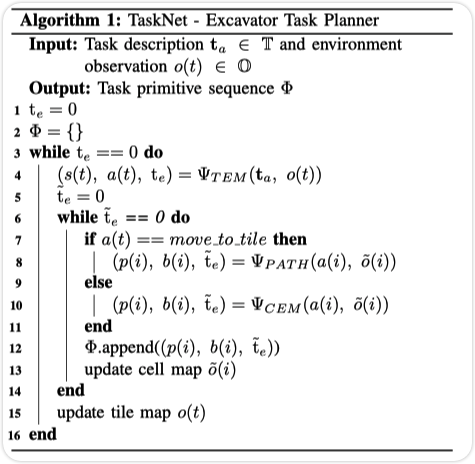
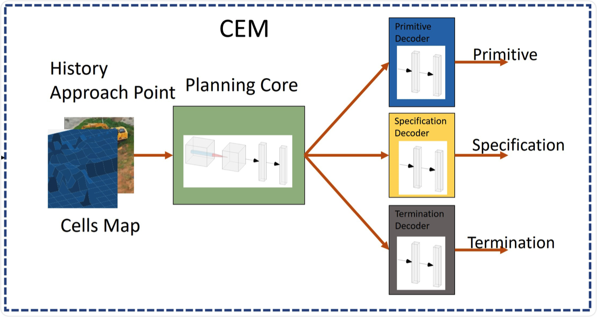

## 为什么要做无人挖掘

**由于极端条件和岩石滑动、地面塌陷或灰尘过多，在现实环境中操作挖掘机可能具有挑战性。**每年在挖掘过程中都会发生多起伤亡事故 。**可以在这些危险环境中替代人工操作员的自动挖掘机将大大降低受伤人数并提高整体生产力。**人类操作员可能不得不在极端工作条件下操作挖掘机。例如，矿场通常位于偏远地区甚至沙漠中，那里的条件包括大量灰尘和极高或极低的温度。此外，地处偏远和远离城市导致现场挖掘机操作员的可用性有限。因此，工人的工作时间和负荷延长，这可能导致更高的疲劳和更多的伤害 。

## 无人挖掘的评判标准

**效率、稳健性和通用性**是设计自主挖掘机的三个基本要求。 换句话说，自主挖掘机应该在没有人工干预的情况下运行，同时执行与人工等效的工作量。

## 基于规划的无人挖掘

解决无人挖掘问题，设定基本动作。通过规划算法实现无人挖掘。

## 基于强化学习的无人挖掘

解决规划适用性问题，实现自上向下的感知-规划-控制模块。能够将系统更广泛的应用在各种环境下。

## 问题定义1

问题 1：给定时间 $t$ 的环境观察反馈 $o(t)$ ∈ O 和任务描述$ t_a $∈ T，设计一个任务规划器，使其可以生成一系列子任务和规范
$[(s_1 , a_1 ), (s_2 , a_2 ), (s_3 , a_3 ), ..., (s_m , a_m )]$

其中 $s_i $∈ S 和 $a_i$ ∈ A; 此外，计划者应将此类序列转换为具有详细规范的任务原语
Φ = $[(p_1 , b_1 ), (p_2 , b_2 ), (p_3 , b_3 ), ..., (p_n , b_n )]$,
其中$ p_i $∈ P 和 $b_i $∈ B。在执行任务原语 g($t_a$ , o(t)) = 1 之后。

### 环境观测

将地形表示为二维网格图，网格图尺寸与铲斗尺寸相同，$x$为横坐标，$y$为纵坐标，$H(x,y)$表示为$(x,y)$坐标高度值,定义目标高度为$H_{target}(x,y)$,任务目标可设置为
$$
H(x, y)=\left|{H}(x, y)-H_{\text {target }}(x, y)\right|<\epsilon, \quad \forall x \text { and } y
$$

[^]: TaskNet: A Neural Task Planner for Autonomous Excavator

设计移动到瓦片和挖掘瓦片两个子任务来描述这两类运动。此外，在使用固定底座进行挖掘时，挖掘机臂的运动可以分解为选择下一个挖掘点，挖掘具有选定深度的特定位置，然后倾倒到所需位置。

|             (S×A)              |         (P × B)         |
| :----------------------------: | :---------------------: |
|   (移动到待挖掘块, 全局坐标)   | (move base, trajectory) |
| （挖掘待挖掘块，待挖掘块地形） |   （接近，局部坐标）    |
|                                |     （挖掘，深度）      |
|                                |   （倾倒，本地坐标）    |

基于神经网络的任务规划器的两层模型

1. Tile Excavation Model (TEM)
2. Cell Excavation Model (CEM)

$$
\left(s(t), a(t), \mathrm{t}_e\right)=\Psi_{T E M}\left(\mathbf{t}_a, o(t)\right)
$$
$t_a$为任务描述，$o(t)$为环境观察反馈，$s(t)$为子任务，$a(t)$为子任务动作规范集，$t_e$为是否终止规划器

$$
\left(p(i), b(i), \tilde{\mathrm{t}}_e\right)=\Psi_{C E M}(a(i), \tilde{o}(i))
$$
此外，为了处理移动到瓦片子任务分配的路径规划问题，我们将路径规划模块定义为
$$
\left(p(i), b(i), \tilde{\mathrm{t}}_e\right)=\Psi_{P A T H}(a(i), \tilde{o}(i))
$$
TEM 的索引是 t，CEM/PATH 的索引是 i，以区分两个模型之间的时间尺度。 总体任务规划算法如算法 1 所示。

## 从离散计划到连续运动
所提出的分层任务计划器**分解高级任务**并产生**一系列具有规范的任务原语**。 生成的基元序列对于现有的规划算法来说是一个自然直接的运动规划问题，例如 运动规划的随机轨迹优化[23]。 这些具有详细规范的任务原语被馈送到运动规划器以生成轨迹。 关节运动或挖掘机底座运动的轨迹将由挖掘机控制器执行。 除了生成整个基元动作序列，TaskNet 还可以用于**在线策略执行**，TaskNet 根据**当前观察确定任务基元**，然后将其发送给运动规划器和控制器进行在线执行。

## 模型

我们介绍了tile开挖模型 (TEM) 和cell开挖模型 (CEM) 的设计。 两种模型具有相似的结构，由四个子模型组成，即规划核心$ f_{core}$、子任务或原始解码器 $f_x$、规范解码器 $f_{spec}$ 和终止解码器$ f_{term}$。 给定一般输入表示 u，模型的一般工作流程可以描述为 
$$
\begin{aligned}
x &=f_{\text {core }}(u) \\
y_1=f_x(x), \quad y_2 &=f_{\text {spec }}(x), \quad y_3=f_{\text {term }}(x)
\end{aligned}
$$
其中 y 1 ∈ { s(t), p(i) } 是子任务或原始任务，y 2 ∈ { a(t), b(i) } 是规范，y 3 ∈ { t e (t)， ∼t e (i) } 表示终止指示符。 下面提供了每个规划模型的详细信息。

TEM 和 CEM 共享相同的网络结构，但使用不同的权重。 规划核心网络由 2 层卷积神经网络 (CNN) 组成，kernel大小为 3，stride大小为 1，padding大小为 1。每个 CNN 层后面都有一个 ReLU 激活函数和内核大小为 2 的 MaxPooling， 步幅大小为 1。解码器都是多层感知器，具有 2 层大小为 128 的全连接 (FC) 神经网络。

在这个瓦片挖掘规划级别，给定瓦片地图作为输入任务，我们需要确定瓦片的全局序列以覆盖大地形。 TEM根据**最新的瓷砖地图**和加工瓷砖的历史预测挖掘机需要操作的下一块瓷砖。 特别是，TEM 采用瓦片图 $G_{tile} (t)$ 的输入和子任务 (s(t), s(t-1), ..., s(t-k)) 的过去结果。 因此 TEM 的输入为
$$
u(t)=\left(G_{t i l e}(t),(s(t), s(t-1), \ldots, s(t-k))\right)
$$
TEM 输出子任务移动到瓷砖或挖掘瓷砖。 这个规范从四个可能的方向{左、右、下、上}中选择子任务移动到图块，以指示下一个要移动的图块。 给定移动方向，我们可以计算一个全局坐标位置来指定挖掘机底座移动到的位置。In case, TEM outputs the sub-task excavate tile. The specification for local terrain heighmap within this tile.

瓦片图被馈送到卷积层进行特征提取。 为了模仿训练数据中的瓦片处理顺序，我们需要使用已处理瓦片的记录。 我们将过去的瓦片移动方向序列堆叠为带有从瓦片图中提取的特征的向量。 连接的向量被馈送到多个完全连接的连接层，这些层生成适当的子任务。 与使用基于循环的实现的 NPI 模型不同，我们选择堆叠历史信息作为全连接层的输入，主要是为了高效训练和快速收敛。

## Cell Excavation Model

单元挖掘模型由具有其规范的瓦片挖掘子任务触发。规范是局部地形高度图，是整个任务地形高度图的一部分，由瓦片挖掘模型切碎。 给定局部地形图，单元挖掘模型生成接近和挖掘的任务原语序列。
给定具有规范 a 的子任务挖掘瓦片，模型的输入包括根据规范 a 的局部地形观测 o(i) 和最后一个任务原始方法规范 b(i - 1)，表示为 作为二维单热向量。 因此细胞挖掘模型的输入可以表示为
$$
u(i)=\left(G_{t i l e}(i), b(i-1)\right) \in \mathbb{R}^{\mathrm{h} \times \mathrm{w} \times 2}
$$
其中 h 和 w 是局部地形观测的高度和宽度。核心模型首先接受这样的输入 u(i) 并产生局部规划状态 s(i)。 接下来，图元解码器采用局部规划状态来产生基础动作选择 p(i)，要么接近末端执行器到某个点，要么在当前位置挖掘一定深度； 规范解码器采用〜s（i）为每个基元生成规范b（i），即接近基元的局部坐标或挖掘基元的深度。 输出表示为 one-hot 向量； 终止解码器也使用〜s（i）来预测〜t e（i），无论子任务是否已完成。

## 模型训练

TEM 和 CEM 模型都以类似的监督方式使用执行跟踪序列进行训练。 在这里，我们对模型的输入和输出使用通用符号表示来统一描述训练过程。 记录的序列是输入-输出对列表 (u, (^y 1 , y2 ^ , y3 ^ ))，其中 u, y 1 , y 2 和 y 3 由 (5) (6) 和 (7) 定义， 分别用于 TEM 和 CEM。

训练目标是最大化生成正确执行序列对的概率。 因此，损失函数被定义为预测的子任务/原语、规范、终止状态和记录的训练数据中的误差的加权和。 损失函数表示如下
$$
\mathcal{L}=\sum \alpha \mathcal{L}_p\left(y_1, \hat{y}_1\right)+\beta \mathcal{L}_b\left(y_2, \hat{y}_2\right)+\gamma \mathcal{L}_t\left(y_3, \hat{y}_3\right)
$$
其中 α、β 和 γ 是参数，$\mathcal{L}_p,\mathcal{L}_b,\mathcal{L}_t$ 分别是子任务/原始、规范和终止的交叉熵损失函数。

在本实验中，TEM 和 CEM 模型的训练数据序列大多是通过基于规则的模拟自动合成的。模拟规则被设置为尽可能模仿在现实世界中观察到的人类行为。真实世界的数据应该不同于我们合成的数据序列，并且是更好的训练来源。因此，我们邀请人工操作员进行挖掘任务并记录数据。真实世界的人类操作数据用于在真实世界实验之前微调我们的模型。

瓷砖开挖模型 对于 TEM 训练，通过开挖模拟生成的瓷砖开挖序列遵循两种模式。一种模式是遍历每个网格来完成任务。另一条规则是跳过特定的网格，如图 3 所示。
训练数据由 3,000 个不同维度的 tilemaps 组成，维度高达 32x32，总共 1,126,900 个样本。每个网格图都是随机生成的，由挖掘和非挖掘瓦片组成。我们在这个数据集上训练 TEM 并在随机生成的瓦片地图上进行测试，这些瓦片地图在我们的训练数据集中不存在。在我们的实现中，我们将向量的大小设置为 8 以存储历史运动信息，以实现高效训练和快速收敛。如图 3 所示，我们学习的 TEM 模型可以跳过非挖掘瓦片并以之字形顺序覆盖其余瓦片，用于随机生成的测试用例。

单元开挖规划问题的开挖模拟遵循先挖当前最高网格的规则。 CEM 模型的训练数据由 10, 000 个序列组成，最大维度为 6 × 6。该模型以 1, 000 的批大小进行训练，学习率为 1e - 3。

性能评估 为了说明模型的性能，实现并测试了**另外两个神经网络结构**。一种是朴素的**纯模仿学习网络**，由 2 层卷积核大小为 3 的 CNN 和 4 层神经元大小为 256、128、128 的**多层感知器**组成。每一层的激活函数选择为 ReLU。另一种是TaskNet 的修改版本，在TEM 和CEM 之间具有共享核心网络，遵循[13] 中的NTP 思想。 TEM 和 CEM 的规划核心网络共享结构和权重。这些任务规划器使用第 III-A 节中描述的瓷砖和单元挖掘规划问题进行测试。

T：任务描述集

O ：环境观察集

g : T × O → { 0, 1 }「任务是否完成（g = 1）或未完成（g = 0）」

S ：子任务集

A ：子任务动作规范集

P ：基础动作集

B ：基础动作规范集

## 分层规划器架构

[^]: Hierarchical Planning for Autonomous Excavator on Material Loading Tasks

有两个级别的任务计划器加上一个级别的运动原语。

从上到下，它们是高级任务计划层、子任务计划层和运动图元层。

在大多数情况下，挖掘机在其臂的运动以执行挖掘作业和将底座移动到所需位置之间交替进行。

基于这一特点，规划器将挖掘作业和底座移动分为两个线程。

规划师扮演的角色是确定挖掘机需要**移动到哪个位置**以及**挖掘机需要挖掘哪个区域的材料**。对于每个挖掘任务，首先确定挖掘机路线点的顺序，在每个挖掘机路线点，确定挖掘区域（子任务区域）的顺序。一旦按照生成的顺序完成了所有子任务，则认为用户分配的任务已完成。对于手臂运动任务，高级任务规划器假设挖掘机底座是静止的，并计算挖掘机在该固定位置可以到达的子任务区域（材料区域）。对于基本运动任务，规划者要求挖掘机以给定的航向角到达所需的路线点。

挖掘动作子任务规划器命名为 MRSP，

将底座移动子任务规划器命名为 BMSP。 

MRSP从高级任务规划器接收子任务区域，然后决定运动原语并计算相关参数。

BMSP 从高级任务规划器接收挖掘机路径点，并输出两个路径点之间的路径点和相关约束。

在这里，我们根据移动方向和材料残留物的要求定义了两种不同类型的挖掘任务：向前移动任务和向后移动任务。对于前移任务，目标材料在地表之上，这意味着材料去除的目标高度与地表高度相同。只有在挖掘机前面的物料被清除后，挖掘机才能继续前进。另一方面，对于后退任务，**物料的目标高度在地表以下，在清除较近的物料后，挖掘机后退继续。显然，挖沟任务是后向运动任务**，而清桩和大规模清桩是前向运动任务。

1) area center swing angle $\alpha$; 2) area angle range or width $\beta$; 3) near end distance $r_{min}$; 4) remote end distance $r_{max}$.

   

L:长度

W:宽度

初始点距离沟槽起点$r_{max}$

每完成一个子任务后，后退$d = r_{max} - r_{min} - r_o$

总共挖掘次数 $n = [l/d]$

MRSP 根据本地任务区内的 LiDAR 点云找到攻击点 (POA)。

我们在真实挖掘机中执行挖沟任务、拆桩任务，并在模拟中执行大规模拆桩任务。 实测中，使用的挖掘机为徐工490DK，工作重量为36.6吨。 仿真中使用的挖掘机为CAT365CL，工作重量为67.0吨。 我们使用 AGX Dynamics [16] 作为我们的仿真环境。

RTK用于实际测试中的定位，提供厘米定位精度。 位置更新率为 10Hz。 关节角度更新率为 100Hz，精度为 0.1 度。 而我们使用的激光雷达是Livox mid100。 点云更新率为 10Hz。 我们在模拟中使用相同的传感器更新率。

基于实验结果，我们得出结论，使用提出的材料移除子任务规划器和基础移动子任务规划器，我们的方法是一个通用的自主挖掘机规划系统架构，可以适应不同的挖掘任务。

# CNN规划

history action ：挑选「上下左右」一个格子或者选择挖掘此单元格

1. 输入：摄像头和激光测距仪  输入有一个单独的强度反馈单元和两个retinas
   1) 道路强度反馈单元指示道路是否比之前图像中的非道路更亮或更暗
   2) 第一个视网膜由 30x32 单元组成，接收来自道路场景的摄像机输入。该视网膜中每个单元的激活水平与图像相应补丁的蓝色带中的强度成正比。使用彩色图像的蓝色波段是因为它提供了道路和非道路之间的最高对比度。
   3) 第二个视网膜由 8x32 个单元组成，接收来自激光测距仪的输入。这个视网膜中每个单元的激活水平与图像中相应区域的接近程度成正比。道路强度反馈单元指示道路是否比之前图像中的非道路更亮或更暗。

这 1217 个输入单元中的每一个都完全连接到 29 个单元的隐藏层，而隐藏层又完全连接到输出层。

2. 输出：车辆应行驶的方向
   1. 第一组 45 个单位是转弯曲率的线性表示，车辆应沿着该曲率行进以驶向道路中心。
   2. 最后的输出单元是道路强度反馈单元，指示当前图像中道路比非道路亮还是暗。

训练集：模拟道路图像

### 数据收集

训练数据序列通过基于规则的模拟自动合成的。

训练数据由 3,000 个不同维度的 tilemaps 组成，维度高达 32x32，总共 1,126,900 个样本。

单元开挖规划问题的开挖模拟遵循先挖当前最高网格的规则。 CEM 模型的训练数据由 10, 000 个序列组成，最大维度为 6 × 6。该模型以 1, 000 的批大小进行训练，学习率为 1e - 3。

#### 单元挖掘模型

单元挖掘模型使用跟踪生成器进行训练，以生成合成数据。

单元开挖规划问题的开挖模拟遵循先挖当前最高网格的规则。 CEM 模型的训练数据由 10, 000 个序列组成，最大维度为 6 × 6。该模型以 1, 000 的批大小进行训练，学习率为 1e - 3。

随机瓷砖地图。 (a) 30x30 瓦片地图是随机生成的，其中只需要处理蓝色瓦片。 我们学习的 TEM 模型可以以之字形顺序覆盖蓝色瓷砖（例如，从左向右移动、向下移动、然后从右向左移动）并跳过绿色瓷砖。 该模型能够泛化瓷砖地图，这在我们的训练数据集中不存在。

### 实验结果

A. 规划器实施和模拟结果
我们使用经过训练的瓷砖挖掘模型和单元挖掘模型来实现任务规划器 TaskNet。任务规划器将高级任务目标作为输入，例如挖一个具有所需深度的矩形作为目标高度图 G target 。它分解任务并生成具有运动规划器规范的运动原语序列。运动规划器模型根据规范计算可行的手臂和基础运动。我们利用轨迹优化进行手臂运动规划和基于网格的基本运动搜索算法。
